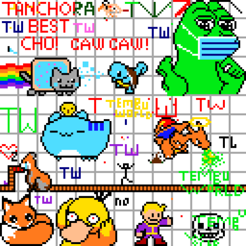

# tPlace 

## Canvas Photos

tPlace is a recreation of Reddit's [r/place](https://en.wikipedia.org/wiki/Place_(Reddit)) for Tembusu Welcome Week 2020.
This implementation takes heavy inspiration from 
[this blogpost](https://redditblog.com/2017/04/13/how-we-built-rplace/) by Reddit.

tPlace aims to be a multi-user online interactive canvas authenticated via Telegram accounts. Using valid Telegram
chats, users can access the tPlace bot and start drawing on the canvas. tPlace supports 16 different color types, along
with interactive real-time socket programming to ensure that users can view changes made by other users in real-time.
Users can access the page via desktop or mobile.

Each user draws on the canvas by placing pixels. Users will encounter a cooldown timer after they place a pixel. This is
to ensure that users must collaborate in order to make larger drawings. Users can also accumulate pixels up to a
certain limit before placing them as they wish.

## Tech Stack

The stack that was used for this implementation is:
- **PostgreSQL** for the database
- **Redis** for the canvas cache
- **Telegraf** for Telegram integration
- **Socket.io** for real-time interactivity
- **JavaScript** for frontend programming elements
- **ExpressJS** for RESTful API implementation
- **Docker** for deployment
- **Elastic Beanstalk** on AWS for server hosting

## Credits

- [Sahil](https://github.com/Sahilgat): PostgreSQL database and Telegram integration
- [Sam](https://github.com/Sam-limyr): Redis cache and Frontend development
- [Khairul](https://github.com/khairulazman1997): Telegram integration and ExpressJS
- [Hui Ling](https://github.com/porkeypine): Main Frontend developer
- [Yi Jia](https://github.com/fluffysaur): Mobile integration and Socket.io
- [Rohan](https://github.com/rohan-av): Dockerization, Deployment and DevOps

## To use as intended:

1. A hosting server must be used and this program must be running on the server.
2. Install the Telegram bot ('**@TembusuPlaceBot**') on any Telegram chat ([instructions](https://docs.google.com/presentation/d/1PvEgIjDTDicbbiSd4Mj8fXBc6uV1n9qT9pmAv2R-OfI/edit#slide=id.g8c821f1979_0_204)).
3. Ensure that the chat is whitelisted via the Telegram bot.
4. Access the canvas as desired.

## To use as a standalone:

1. Follow the instructions in the section below to download Docker.
2. Run this program via Docker.
3. Go to your localhost on any web browser to access the API calls.

## Using Docker:

Docker is a useful tool in development. When using Docker, you do not need to download Redis or PostgreSQL separately on your machine. With `docker-compose`, you can run multiple services at once, streamlining the otherwise cumbersome testing process.

1. Download Docker Desktop (if your OS allows for it) from https://docs.docker.com/docker-for-windows/install/ (Windows Pro), https://docs.docker.com/docker-for-windows/install-windows-home/ (Windows Home), or https://docs.docker.com/docker-for-mac/install/ (Mac).
2. Create an account at Docker Hub (https://hub.docker.com/)
3. Click the whale icon and login
4. _(Optional)_ open Settings
5. _(Optional)_ In 'WSL Integration' under 'Resources', enable integration with additional WSL distros (e.g. Ubuntu) if you want to use said distros
6. Navigate to the src folder using Terminal/a WSL2 client
7. Run `docker-compose up --build`
8. After testing the environment, terminate the build gracefully with ^C
9. Run `docker-compose down`. This will remove all the containers from your machine

## Using Redis:

This is only necessary to run as a standalone; not necessary in this program due to Dockerization:

1. Download Redis using either https://redis.io/topics/quickstart (Linux, maybe Mac also) or
   https://redislabs.com/blog/redis-on-windows-10/ (Windows). For file access via WSL on Windows, refer to
   https://www.tenforums.com/tutorials/127857-access-wsl-linux-files-windows-10-a.html.
2. Start up a Linux client and navigate to the directory where the files were extracted to.
3. Start the Redis server using `sudo service redis-server start`.
4. If exploring the server via the command line, use `redis-cli`. Take note that the server must be started before this
   command is used. Otherwise, the CLI will be stuck in a loop of `not connected>` commands. If you get stuck,
   use Ctrl-C to exit.
5. Use the command `sudo service redis-server stop` to stop the server when necessary.
6. While the server is running, code can be run from the same machine, and it will communicate with the server. Take
   note that the default IP is `localhost`, with port number `6379`. These parameters are located in the
   backend/redis_project package. In some cases, these parameters may not be valid if the port is already in use.
